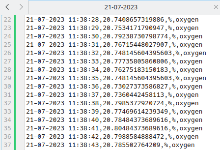
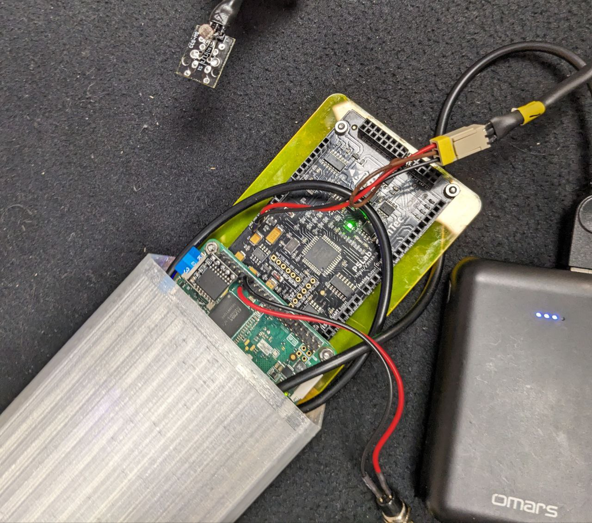
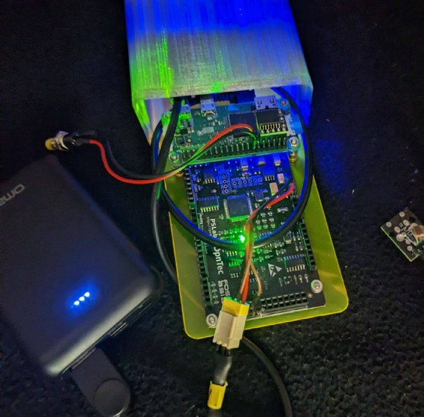
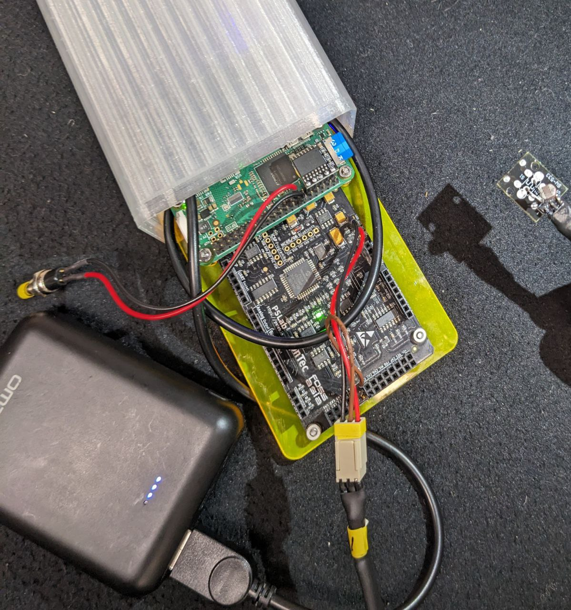

# PSLab

This repo is used for scripts and operators that collect data of specific sensors connected with the PSLab.

[](https://gitter.im/fossasia/pslab-sister?utm_source=badge&utm_medium=badge&utm_campaign=pr-badge)
[](https://twitter.com/pslabio)

PSLab is a tiny pocket science lab that provides an array of equipment for doing science and engineering experiments. It can function like an oscilloscope, waveform generator, frequency counter, programmable voltage and current source and also as a data logger. Our website is at https://pslab.io

## The PSLab Sensor Box

For a quick start jump to the [initial setup](#initial-setup) or the [basic usage](#basic-usage) section.

<p align="center">
    
</p>

In this project four different experimental setups of the [PSLab v5](https://pslab.io/wp-content/uploads/PSLab-Data-Sheet.pdf) are created, each incorporating a different sensor: one measuring [CO2](/docs/sensors.md#⬛-co2e-sensor-ccs811), one for [oxygen](/docs/sensors.md#🟦-oxygen-sensor-ao-03), one for [temperature](/docs/sensors.md#🟩-temperature-sensor-lm35), as well as one setup measuring the [light intensity in lux](/docs/sensors.md#🟨-light-intensity-sensor-gl5528).
Details for those sensor setups can be found in the [docs](/docs/sensors.md).

In addition, the following **hardware components** are connected to the PSLabs:

- A **Raspberry Pi Zero W** to store the sensor data permanently on an SD card and, at the same time, make this data available via the Raspberry Pi's WiFi module. The "Zero" is especially handy here, as it is the most lightweight Raspberry Pi version. Both, the Raspi and the PSLab are screwed on to a plexiglass panel that is slid into the box using the boxe's integrated rail system.
- A **Button** to safely shutdown the Raspberry Pi. It needs to be long pressed for at least one second in order to trigger the device's shutdown. Here, one button terminal is plugged into GPIO pin 27, while the other terminal is plugged to the ground.
- The high accuracy I²C **real time clock (RTC)** model [DS3231](https://www.analog.com/media/en/technical-documentation/data-sheets/DS3231.pdf). It contains a small battery and ensures that the device's time progresses, even if the main power source is unavailable. This RTC therefore makes timestamps in the output data possible during times, where the PSLab sensor box can not access the internet. The five pins of this Pi HAT are plugged into pins 1, 3, 5, 7 and 9 of the Raspberry Pi Zero W.
- A 3D printed, splashproof [casing](/docs/casing/README.md) with a USB c port and a lasercut shield to hold the electronics securely in place.

The following **features** are implemented on top of that:

- Each measured data point is then immediately shared via OSC as `/<item_name> <measured_value>, <unit>, <timestamp>`. Additionally it is written into the CSV file of this measurement session. The file is structured as `<timestamp>, <measured_value>, <unit>, <item_name>`.
- The devices are connected to a public WiFi Network, where they share their data as part of an IoT approach. Initially, each device opened their own WiFi Hotspot, however this was later **discontinued**, as the new requirement of accessing all devices within one common network came up.
- A [samba file sharing server](https://raspberrypi-guide.github.io/filesharing/filesharing-raspberry-pi) makes the folder "/home/foss/data" of the Raspberry Pi publicly available to all devices within the WiFi Hotspot. This also enables users to modify or delete the CSV measurement data within this folder remotely via their PC or mobile phone. The measurements are not only provided to this file sharing server in real-time, but also stored on the SD card permanently.
- The measurement it triggered automatically after startup. This is done by a custom [systemd](https://www.raspberrypi-spy.co.uk/2015/10/how-to-autorun-a-python-script-on-boot-using-systemd/) service.
- The Raspberry Pi itself is running the code from the master branch this Github repository. This makes code updates easy to distribute on all devices. All PSLab sensor boxes run the exact identical code, with the only difference being the experiment type parameter with which `init_pipe.py` is called by the systemd service.

## Accessing the Raspberry Pi

In order to modify the software, the data on the Raspberry Pi's SD card needs to be accessed.
This can either be done by plugging the SD card into a computer, accessing the Raspberry Pi via SSH, or by using the Raspi as a computer itself. In the following, the latter two methods are explained in detail.
In any case, the SD card should never be cleared fully, because this would delete the operating system and therefore stop the Raspberry Pi from working.

### Using the Raspberry Pi as an Independent Computer

Here, a monitor needs to be connected to the microHDMI slot of the Raspi. Simultaneously a mouse and a keyboard need to be linked to the inner microUSB slot via an USB hub. Make sure to perform this cabling-up before attaching the device to the electricity source.

### Accessing the Raspberry Pi via SSH

An [SSH access](https://itsfoss.com/ssh-into-raspberry/) can be more convenient, as there is no additional cabling needed.
However, to establish this connection, the Raspberry Pi needs to be in the same WiFi network as the connecting laptop. If that is not the case yet, there is no way around connecting the Raspi to a monitor first, in oder to set up this WiFi connection, as the Raspberry Pi Zero W does not have a LAN port. Also, the network specific **IP address** of the Raspberry Pi needs to be known. It can be retrieved by executing the command `ifconfig` in the Raspi's terminal while having it connected to a monitor. The IP address can then usually be found in the "wlan0" paragraph and is formatted in a "000.000.000.000" pattern.
To then establish the ssh connection, the following steps need to be executed:

1. Ensure that the PC is connected to the same WiFi Hotspot as the PSLab Sensor Box.
2. Open the SSH connection by running `ssh foss@<ip>` in the PC's terminal and entering the password `foss` when asked.
3. Now you are operating on the Raspberry Pi.

## Initial Setup

Before using the devices in an own network, a one time setup is needed.
Once this is done, for every following usage, please directly jump to the [basic usage](#basic-usage) section.

Both, the OSC messages and the CSV file, of the measurement can be retrieved via WiFi.
Currently, the devices are connected to a dummy WiFi Hotspot with the credentials `myHotspot` as the SSID and `password123"`as the password.
Thus, for basic testing, one can just open a Hotspot with these details on a Phone/PC, the devices will automatically connect and the measurement data can be obtained.

However, for more extensive usage, it is obviously more convenient to connect the PSLab Sensor Boxes to the buildings usual WiFi.
For example a connection to eduroam can be established by [logging in with one's university credentials](https://www.uni-weimar.de/fileadmin/user/uni/zentrale_einrichtungen/scc/wlan/Ubuntu.pdf).
The network connection can be changed by [connecting the Raspberry Pi to a monitor](#using-the-raspberry-pi-as-an-independent-computer) and logging into the new WiFi Hotspot using the graphical user interface. Once connected, it is also possible to [set a static private IP address](https://www.tomshardware.com/how-to/static-ip-raspberry-pi) for the Raspberry Pi in this network.
This can be very useful, for example, in order to make the Raspi reliably accessible via SSH.
Please make sure that the devices can see each other in the network and disable/ reconfigure the [VLAN](https://www.techtarget.com/searchnetworking/definition/virtual-LAN), in case one is set up.

Additionally, the IP address and port of the OSC server, need to be edited according to the actual address of the OSC receiver.
This can be done by adjusting the `OSC_RECEIVER_IP` and the `OSC_RECEIVER_PORT` constants on the Raspberry Pis.
The only loophole to this, is to use a OSC server at the pre-configured IP address of `192.168.173.152`.
However, that's not always possible, depending on the available namespace of the network.

## Basic Usage

Once a power source (power bank or cord to electricity outlet) is connected to the PSLab sensor box and the device has fully booted (this **may take a minute ot two**), a new measurement is automatically started. The measurement results are now simultaneously shared via the [Open Sound Control Protocol (OSC)](https://en.wikipedia.org/wiki/Open_Sound_Control) and collected in a [CSV](https://en.wikipedia.org/wiki/Comma-separated_values) file.
To retrieve this data, please connect your own PC/Phone to the same public WiFi Hotspot, that the PSLab Sensor Box is connected to (see [initial setup](#initial-setup)).

### Accessing the CSV Measurements

The CSV measurements of each PSLab sensor box can be retrieved in real time from the file server via WiFi:

1. A detailed manual on how to connect to the devices file server for the first time can be found in the [docs](/docs/network_connection_manual.md).
2. Once connected, the PSLab will appear in the "Network Devices" section.
<p align="center">
    
</p>
Access the data folder and fetch the most recent CSV measurement data file. This file can for example be opened by Excel or just a normal text editor. The current measurement file is updated automatically every few seconds, to see these real time changes, just close and reopen the file.

<p align="center">
    
</p>

Analysis tasks can now be performed on these data sheets, for example by importing them into [Jupyter Notebook](https://jupyter.org/).

### Receiving the OSC Messages

The OSC messages are sent to the specified IP address upon startup. To receive those messages a OSC server like this is necessary:

```[python]
import argparse
from pythonosc.dispatcher import Dispatcher
from pythonosc import osc_server

if __name__ == "__main__":
    parser = argparse.ArgumentParser()
    parser.add_argument("--ip", default="192.168.173.152")
    parser.add_argument("--port", type=int, default=5005)
    args = parser.parse_args()

    dispatcher = Dispatcher()
    dispatcher.map("/light", print)
    dispatcher.map("/temp", print)
    dispatcher.map("/co2", print)
    dispatcher.map("/oxygen", print)

    server = osc_server.ThreadingOSCUDPServer(
        (args.ip, args.port), dispatcher)
    server.serve_forever()
```

This server uses the [python-osc](https://github.com/attwad/python-osc) package to receive and decode the messages. The package can be installed by executing `pip3 install python-osc` in the PC's terminal.
Please note that this setup only works if the IP address, specified as `OSC_RECEIVER_IP`, is identical to the IP address stated in the server scrips (in line 7 here) and corresponds to the laptops own IP address (obtainable by executing "ifconfig" in the terminal). This OSC server for example produces the following output when, at the same time, the Oxygen Sensor Box and the Light Sensor Box are sending OSC data to this IP address at port 5005:

<p align="center">
    
</p>

### Example Measurement Session

When for example using the PSLab Sensor Box "Lux", changes in the environment's light intensity can be measured.
After attaching the box to a power bank and waiting for two minutes, the device starts measuring.

<p align="center">
    
</p>

The running OSC server on our laptop, that is connected to the same WiFi Hotspot as the Sensor Box, then receives the following data:

```
/light 109.5234702837157 lux 21-07-2023 20:44:12
/light 108.62976013160224 lux 21-07-2023 20:44:13
/light 114.54458695414951 lux 21-07-2023 20:44:14
```

To test the sensor and observe the changes in the environment, the lights are now turned off.

<p align="center">
    
</p>

This results in the following OSC messages:

```
/light 6.80740388396548 lux 21-07-2023 20:46:04
/light 7.05431189748499 lux 21-07-2023 20:46:05
/light 7.52577384043171 lux 21-07-2023 20:46:06
```

To then test the sensor at a very hight brightness, we turned the lights on again and exposed the photoresistor to a flashlight:

<p align="center">
    
</p>

Thus, the OSC server receives these messages:

```
/light 1721.79974583536023 lux 21-07-2023 20:47:38
/light 1902.29013779831879 lux 21-07-2023 20:47:39
/light 1483.70672770591856 lux 21-07-2023 20:46:40
```

In an analogue way, the temperature sensor can be tested by warming it up with one's finger tips,
while the CO2 and oxygen sensors can by tested by exposing them to exhaled air.

### Ending the Session

To eventually trigger the shut down process of the Raspberry Pi, please press the attached button for one to two seconds.
After waiting 20-30 seconds, the shut down is completed, the green indication light on the Raspberry Pi goes off and the electricity source can be unplugged.
Technically, the measurement session can also be terminated by just unplugging the power source directly, however in the long term,
this technique can be harmful for the Raspberry Pi's file system.

## Debugging

As this is a hardware project, it is not unlikely that at some point in time, one of the cables or other components will cause problems. To then solve this, it is important to localize the error. Here, different levels of debugging can help, depending on the supposed location of the problem.
Basic debugging steps may be:

- Turn the Raspberry Pi off (by using the button) and on again (by plugging in a power bank).
- Make sure all cables are attached firmly. Try unplugging and reattaching them.
- Sometimes the output voltage of a laptop's USB port might vary a bit to much, try using a power bank instead.
- Make sure the lights on the PSLab are glowing. Otherwise there probably is a problem with the boxes' charging cable or the PSLab itself.
- Make sure the light on the Raspberry Pi is glowing or blinking. This indicates a successful booting of the Raspbian OS.
- Try using one PSLab Sensor Box after another, not in parallel.
- If the device does not connect to the WiFi network (for example checkable via Linux' `nmap` tool), try having the network open already during the Raspberry Pi's booting process.
- Try opening the Hotspot, that the Sensor Boxes are connected to, from another device (e.g. phone, instead of laptop).

Some more advanced debugging techniques include the following:

### Debugging Sensor Issues - On a PC

To ensure that the PSLab itself and the sensor are working properly,  the following test can be executed.
Please note that this routine is the only one that is executed on a normal (Linux)
**PC, instead of the Raspberry Pi**, in order to abstract from any Raspi specific problems.

1. Ensure that python3 is installed on your PC by running `python3 --version` in the terminal. In case there is no item found, install version 3.6 by `sudo apt-get install python3.6` and reboot your system afterwards to ensure that everything is fully loaded.
2. Install the pslab-python library on the PC by executing `pip3 install pslab`.
3. Detach the PSLab and the corresponding sensor from the Raspberry Pi by removing the
microUSB to microUSB cable between Raspi and PSLab. Instead connect the microUSB port of the PSLab to one of the PC's USB ports.
4. Download the pslab-scripts library by running `sudo git clone https://github.com/fossasia/pslab-scripts.git`.
5. Open the repository folder by executing `cd pslab-scrips`.
6. Start the execution a sensor type specific test by running `sudo python3 init_pipe.py <type>` (for example
`sudo python3 init_pipe.py oxygen`). This execution can always be stopped by hitting ctrl+c.
7. Check the fetched measurement data by accessing the file located in `/home/<user name>/data`.

### Debugging the Startup Script - On the Raspberry Pi

Often times the script itself actually works fine, but the startup manager might start it
too early, causing resource conflicts and other issues to arise.
One option to debug this, is to first make sure that the script itself works fine by running `sudo python3 /home/foss/code/init_pipe.py <type>`
on the Raspberry Pi (for example `sudo python3 init_pipe.py oxygen`) and checking the results in
`/home/foss/data`. If those results look good, but the data fetching upon startup still does not work, the error logs of the startup script can be examined by executing `journalctl -u startup.service --since yesterday` in the Raspi's terminal.

## Advanced Usage

Different software and hardware projects can be realized on this combination of PSLab and Raspberry Pi.
Some ideas for modifying the existing software are listed below.
As python3, the pslab-python library, as well as this pslab-scripts repository, are already installed on the Raspberry Pis, **no** additional installation is needed here.

### Adjusting the measurement interval

Currently a new data point is retrieved from the sensor every second. This can be changed by adjusting the value for the`MEASURING_INTERVAL`. This constant can be found in the `/home/foss/pslab-scripts/measure.py` file on the Raspberry Pi.

### Adjusting the flushing interval

The data points are flushed into the CSV file after every 10 measurements in the current implementation. To change this, the `FLUSHING_THRESHOLD` value in `/home/foss/pslab-scripts/store_data.py` can be adjusted on the Raspi.

### Accessing the continuous measurement data stream via an API

As of now, the measurement data is redirected into a CSV file and OSC messages by the pipe function. This can however be modified freely, for example by adding an additional step 
to transform and output some data into the data exporting function.
This new process can freely process the measured data points, received via `connection.recv()`.

### Fetching a software update from Github

1. Open the terminal.
2. Open the folder "pslab-scripts" by typing `cd /home/foss/pslab-scripts`.
3. Enter `git pull` in the terminal to fetch the new changes in software.

### Changing the sensor type

By adjusting the experiment type parameter in the systemd service "startup.service", the supported sensor type of this specific PSLab sensor box can be changed easily:

1. Open a terminal.
2. Type `sudo nano /lib/systemd/system/startup.service`.
3. The "startup.service" file is now opened in a simple text editor. Here, you can adjust the experiment type parameter, e.g. from "light" to "co2", in case the PSLab sensor box for light shall now be used with a CO2 sensor. Besides "light" and "co2", also "oxygen" and "temp", are supported as parameters here.
4. Save the changes by pressing ctrl+o. Exit the editor by pressing ctrl+x.
5. The changes take effect once the device is rebooted. This can for example be done by executing `sudo reboot`.

## Repository Structure

```
📦pslab-scripts
 ┣ 📂docs                               # Supplementary material
 ┃ ┣ 📂ao-03_amplifier_circuit_design  # KiCad project files of the custom circuit board for the AO-03 sensor
 ┃ ┃ ┗ 📜...
 ┃ ┣ 📂casing                          # Information about the 3d printed casing, as well as the lasercut shield
 ┃ ┃ ┣ 📜README.md
 ┃ ┃ ┗ 📜...
 ┃ ┣ 📂images
 ┃ ┃ ┗ 📜...
 ┃ ┣ 📂logos                           # Sticker designs for the boxes (made with Inkscape)
 ┃ ┃ ┗ 📜...
 ┃ ┣ 📜network_connection_manual.md    # Manual on how to connect a device to the PSLab's file server
 ┃ ┣ 📜presentation_may28.pdf
 ┃ ┣ 📜sensors.md                      # Detailed descriptions of all four sensor setups
 ┃ ┗ 📜testing_manual.md               # Detailed manual on how to test the devices
 ┣ 📂sensors                            # Contains a specific run script for every sensor
 ┃ ┣ 📜ao03_oxygen.py
 ┃ ┣ 📜ccs811_co2.py
 ┃ ┣ 📜driver_ccs811.py                # Custom driver for the CCS811 sensor
 ┃ ┣ 📜gl5528_light.py
 ┃ ┗ 📜lm35_temp.py
 ┣ 📜export_data.py                     # Sharing the measurements via OSC and CSV
 ┣ 📜init_pipe.py                       # Main project file
 ┣ 📜measure.py
 ┗ 📜shutdown.py                        # Script for the button logic
```

## Buy

* You can get a Pocket Science Lab device from the [FOSSASIA Shop](https://fossasia.com).
* More resellers are listed on the [PSLab website](https://pslab.io/shop/).

## Communication

* The PSLab [chat channel is on Gitter](https://gitter.im/fossasia/pslab).
* Please also join us on the [PSLab Mailing List](https://groups.google.com/forum/#!forum/pslab-fossasia).

## Site

The website is hosted on [pslab.io](http://pslab.io).