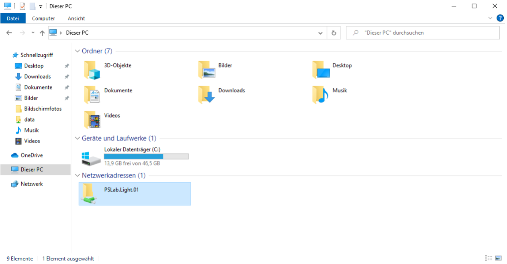
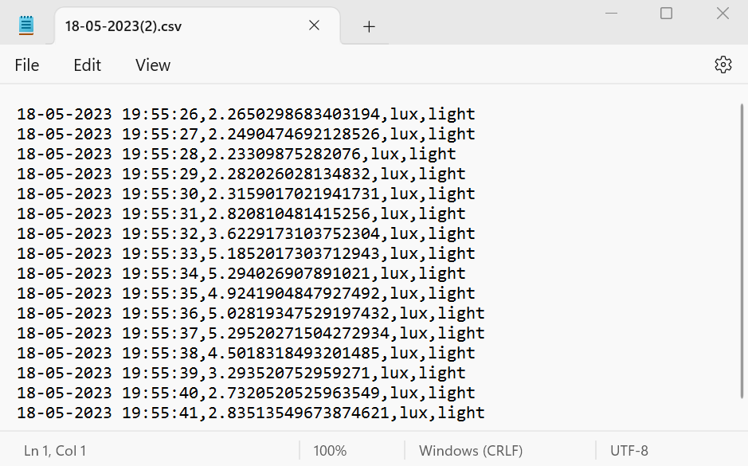

# PSLab

This repo is used for scripts and operators to run and collect data of specific sensors connected with the PSLab.

[](https://gitter.im/fossasia/pslab-sister?utm_source=badge&utm_medium=badge&utm_campaign=pr-badge)
[](https://twitter.com/pslabio)

PSLab is a tiny pocket science lab that provides an array of equipment for doing science and engineering experiments. It can function like an oscilloscope, waveform generator, frequency counter, programmable voltage and current source and also as a data logger. Our website is at https://pslab.io

## The PSLab Sensor Box

<p align="center">
    
</p>

In this project four different experimental setups of the [PSLab v5](https://pslab.io/wp-content/uploads/PSLab-Data-Sheet.pdf) are created, each incorporating a different sensor. Details for those sensor setups can be found [here](/docs/sensors.md). In addition, the following **hardware components** are connected to the PSLabs:

- A **Raspberry Pi Zero W** to store the sensor data permanently on an SD card and at the same time make this data available via the Raspberry Pi's WiFi module. The "Zero" is especially handy here, as it is the most lightweight Raspberry Pi version.
- A **Button** to safely shutdown the Raspberry Pi. It needs to be long pressed for at least one second in order to trigger the device's shutdown. Here, one button terminal is plugged into GPIO pin 27, while the other terminal is plugged to the ground.
- The high accuracy I²C **real time clock (RTC)** model [DS3231](https://www.analog.com/media/en/technical-documentation/data-sheets/DS3231.pdf). It contains a small battery and ensures that the device's time progresses, even if the main power source is unavailable. This RTC therefore makes timestamps in the output data possible, even during times where the PSLab sensor box can not access the internet. The five pins of this Pi HAT are plugged into pins 1 (3.3V power), 3 (SDA I²C), 5 (SCL I²C), 7 and 9 (ground) of the Raspberry Pi Zero W.

The following **features** are implemented on top of that:
- Each PSLab sensor box automatically opens its own WiFi Hotspot, once the system is connected to an energy source and finished its booting process (which may take one or two minutes).
- Additionally, the measurement it triggered automatically after startup. This is done by a custom [systemd](https://www.raspberrypi-spy.co.uk/2015/10/how-to-autorun-a-python-script-on-boot-using-systemd/) service.
- Each measured data point is then written into the CSV file of this measurement session. The file is structured as `<timestamp>, <measured_value>, <unit>, <item_name>`.
- A [samba file sharing server](https://raspberrypi-guide.github.io/filesharing/filesharing-raspberry-pi) makes the folder "/home/foss/data" of the Raspberry Pi publicly available to all devices within its WiFi Hotspot. This also enables users to modify or delete the measurement data within this folder remotely via their PC or mobile phone.
- The measurements are provided to this file sharing server in real-time, however they are also stored there permanently via the SD card. The user can thus combine the benefits of both measurement forms.
- The Raspberry Pi itself is currently running the code from the master branch this Github repository. This makes code updates easy to distribute on all devices. All PSLab sensor boxes run the exact identical code, with the only difference being the experiment type parameter with which `init_pipe.py` is called in the systemd service.

## Basic Usage

Once a power source (power bank or cord to electricity outlet) is connected to the PSLab sensor box and the device has fully booted, a new measurement is automatically started. The measurement results are now collected in a CSV and can be exported in real time from the file server via WiFi:

1. Connect your computer or smartphone to the WiFi Hotspot with the corresponding name (like "PSLab.Light.01"). A detailed manual on how to connect for the first time can be found [here](/docs/network_connection_manual.md).
2. Once connected, the PSLab will appear in the "Network Devices" section.
<p align="center">
    
</p>
Access the "data" folder and fetch some CSV measurement data file. This file can for example be opened by Excel or just a normal text editor. The current measurement file is updated automatically every few seconds.
<p align="center">
    
</p>

Analysis tasks can now be performed on this data, for example importing it into [Jupyter Notebook](https://jupyter.org/).

To trigger the shut down process of the PSLab sensor box, please press the attached button for one to two seconds.

## Advanced Usage

First of all, as part of the open hardware approach, we obviously want you to be able to check out the electronics inside the device. As as a disclaimer: do **not** open the box with brute force. There is a trick in opening it by angling out the lid from the lower side. This works even better when using a screw driver.
<p align="center">
    
</p>

As python3, the pslab-python library, as well as this pslab-scripts repository, are already installed on the Raspberry Pis, **no** additional installation is needed here.

### Accessing the Data on the Raspberry Pi

In order to modify the software, the data on the Raspberry Pi's SD card needs to be accessed.
This can either be done by plugging the SD card into a computer, accessing the Raspberry Pi via SSH, or by using the Raspi as a computer itself. In the following, the latter two methods are explained in detail.

In any case, the SD card should never be cleared fully, because this would delete the operating system and therefore stop the Raspberry Pi from working.

#### Using the Raspberry Pi as an Independent Computer

Here, a monitor needs to be connected to the microHDMI slot of the Raspi. Simultaneously a mouse and a keyboard need to be linked to the inner microUSB slot via an USB hub. Make sure to perform this cabling-up before attaching the device to the electricity source.
As this option provides a graphical user interface for editing and debugging, it is usually preferable for beginners.

#### Accessing the Raspberry Pi via SSH

An [SSH access](https://itsfoss.com/ssh-into-raspberry/) can be more convenient, as there is no additional cabling needed.
However, to establish this connection, the Raspberry Pi needs to be in the same WiFi network as the connecting laptop. If that is not the case yet, there is no way around connecting the Raspi to a monitor first, in oder to set up this WiFi connection, as the Raspberry Pi Zero W does not have a LAN port. Also, the network specific IP address of the Raspberry Pi needs to be known.

As the Raspi is currently connected to its very own WiFi Hotspot, an access via SSH is easily possible:

1. Ensure that the PC is connected to the WiFi Hotspot of the PSLab Sensor Box.
2. Open the SSH connection by running `ssh foss@10.42.0.1` in the terminal and
entering the password "foss" when asked.
3. Now you are operating on the Raspberry Pi.

### Adjusting the measurement interval

Currently a new data point is retrieved from the sensor every second. This can be changed by adjusting the measuring_interval parameter in [measure.py](/measure.py). The file can be found at `/home/foss/pslab-scripts/measure.py` on the Raspberry Pi.

### Adjusting the flushing interval

The data points are flushed into the CSV file after every 10 measurements in the current implementation. To change this, the flushing_threshold parameter in [store_data.py](/store_data.py) at `/home/foss/pslab-scripts/store_data.py` can be adjusted.

### Accessing the continuous measurement data stream via an API

As of now, the measurement data is redirected into a CSV file by the pipe function in [init_pipe.py](/init_pipe.py). This can however be modified freely, for example by replacing the "storing" process, with a process that transforms the data and directly outputs it. This new process will always receive the measurement data points via its connection parameter (see [store_data.py](/store_data.py)).

### Fetching a software update from Github

1. Open the terminal.
2. Open the folder "pslab-scripts" by typing `cd /home/foss/pslab-scripts`.
3. Disconnect from the PSLab sensor boxes' WiFi Hotspot and connect the device to a WiFi that actually provides internet. Don't forget to eventually re-connect to its own WiFi Hotspot again, as the file server will otherwise not be accessible.
4. Enter `git pull` in the terminal to fetch the new changes in software.

### Changing the sensor type

By adjusting the experiment type parameter in the systemd service "startup.service", the supported sensor type of this specific PSLab sensor box can be changed easily:

1. Open a terminal.
2. Type `sudo nano /lib/systemd/system/startup.service`.
3. The "startup.service" file is now opened in a simple text editor. Here, you can adjust the experiment type parameter, e.g. from "light" to "co2", in case the PSLab sensor box for light shall now be used with a CO2 sensor. The full list of currently supported parameters can be found [here](/measure.py).
4. Save the changes by pressing Ctrl+o. Exit the editor by pressing Ctrl+x.
5. The changes take effect once the device is rebooted. This can for example be done by `sudo reboot`.

### Debugging

As this is a hardware project, it is not unlikely that at some point in time one of the cables or other components will cause problems. To then solve this, it is important to localize the error. Here, different levels of debugging can help, depending on the supposed location of the problem.
Some of the most useful ones are:

#### Debugging Sensor Issues - On a PC

To ensure that the PSLab itself and the sensor are working properly,  the following test can be executed.
Please note that this routine is the only one that is executed on a normal (Linux)
**PC, instead of the Raspberry Pi**, in order to abstract from any Raspi specific problems.

1. Ensure that python3 is installed on your PC by running `python3 --version` in the terminal. In case there is no item found, install version 3.6 by `sudo apt-get install python3.6`.
2. Install the pslab-python library on the PC by executing `sudo apt-get install pslab`.
3. Detach the PSLab and the corresponding sensor from the Raspberry Pi by removing the
microUSB to microUSB cable between Raspi and PSLab. Instead connect the microUSB port of the PSLab to one of the PC's USB ports.
4. Download the pslab-scripts library by running `sudo git clone https://github.com/fossasia/pslab-scripts.git`.
5. Open the repository folder by executing `cd pslab-scrips`.
6. Start the execution a sensor type specific test by running `sudo python3 init_pipe.py <type>` (for example
`sudo python3 init_pipe.py oxygen`). This execution can always be stopped by hitting ctrl+c.
7. Check the fetched measurement data by accessing the file located in `/home/<user name>/data`.

#### Debugging the Startup Script - On the Raspberry Pi

Often times the script itself actually works fine, but the startup manager might start it
too early, causing resource conflicts and other issues to arise.
One option to debug this, is to first make sure that the script itself works fine by running `sudo python3 /home/foss/code/init_pipe.py <type>`
on the Raspberry Pi (for example `sudo python3 init_pipe.py oxygen`) and checking the results in
`/home/foss/data`. If those results look good, but the data fetching upon startup still does not work, the error logs of the startup script can be examined by executing `journalctl -u startup.service --since yesterday` in the Raspi's terminal.

## Repository Structure

```
📦pslab-scripts
 ┣ 📂docs                                   # Supplementary material
 ┃ ┣ 📂ao-03_amplifier_circuit_design       # KiCad project files of the custom circuit board for the AO-03 sensor
 ┃ ┃ ┗ 📜 ...
 ┃ ┣ 📂images
 ┃ ┃ ┣ 📜sensor_logos.svg                   # Sticker designs for the boxes (made with Inkscape)
 ┃ ┃ ┗ 📜 ...
 ┃ ┣ 📜network_connection_manual.md         # Manual on how to connect a device to the PSLab's file server
 ┃ ┣ 📜presentation_may28.pdf
 ┃ ┣ 📜sensors.md                           # Detailed descriptions of all four sensor setups
 ┃ ┗ 📜testing_manual_june12.md             # Detailed manual on how to test the prototype
 ┣ 📂sensors                                # Contains a specific run script for every sensor
 ┃ ┣ 📜ao03_oxygen.py
 ┃ ┣ 📜ccs811_co2.py
 ┃ ┣ 📜gl5528_light.py
 ┃ ┗ 📜lm35_temp.py
 ┣ 📜init_pipe.py                           # Main project file
 ┣ 📜measure.py
 ┣ 📜store_data.py
 ┗ 📜shutdown.py                            # Script for the button logic
```

## Buy

* You can get a Pocket Science Lab device from the [FOSSASIA Shop](https://fossasia.com).
* More resellers are listed on the [PSLab website](https://pslab.io/shop/).

## Communication

* The PSLab [chat channel is on Gitter](https://gitter.im/fossasia/pslab).
* Please also join us on the [PSLab Mailing List](https://groups.google.com/forum/#!forum/pslab-fossasia).

## Site

The website is hosted on [pslab.io](http://pslab.io).