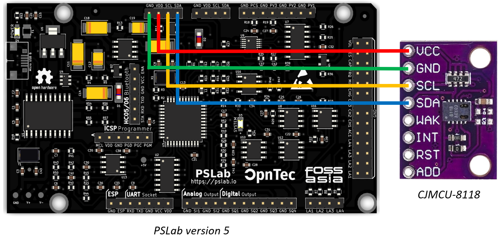
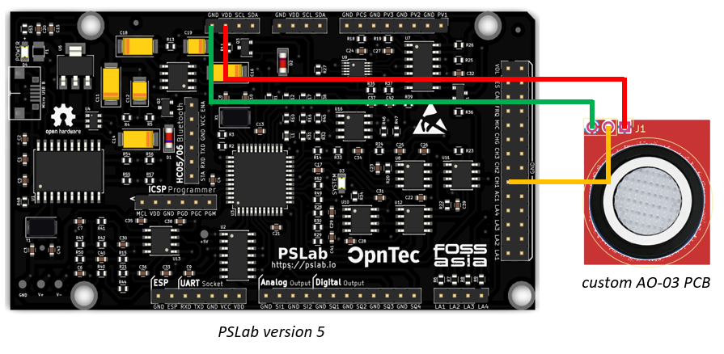
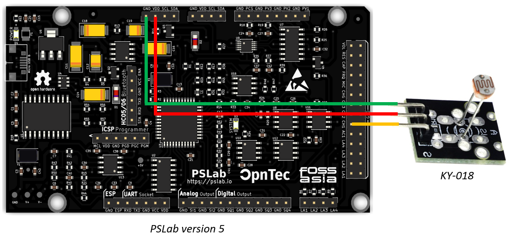
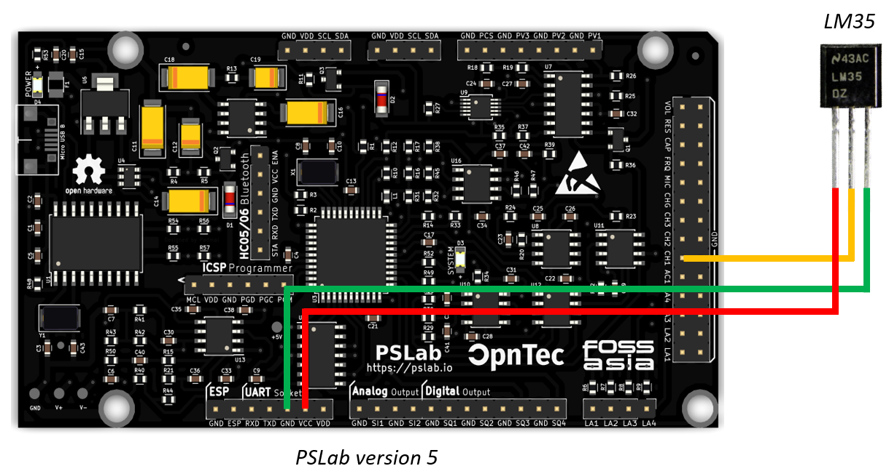

Currently the following sensors are supported by specific firmware here, however [others](https://pslab.io/sensors/) could be added later on.

## CO2e Sensor: [CCS811](https://cdn.sparkfun.com/assets/learn_tutorials/1/4/3/CCS811_Datasheet-DS000459.pdf)

This digital sensor is embedded on the [CJMCU-8118](https://www.amazon.co.jp/-/en/CJMCU-8118-HDC1080-Monoxide-Temperature-Humidity/dp/B07KWPHYLY) circuit board and powered by a custom [driver](https://github.com/fossasia/pslab-python/tree/development/pslab/external) that uses the sensors I²C protocol.

The CCS811 measures the [CO2e](https://klima.com/blog/what-is-co2e/) ("CO2 equivalent") value of the surrounding air in particles per million (ppm). This value also incorporates the levels of methane (CH4), nitrous dioxide (N2O) and other synthetic gases, besides the regular CO2 measurement, which makes up about 75% of the CO2e. This value is therefore used by environmental scientists nowadays to give more accurate measurements about the current levels of emissions in the air.

As emissions vary depending on the air's temperature and humidity, the CCS811 sensor has inbuilt temperature and moisture sensors. It uses those to offset the variation of the measuring conditions to the optimal lab conditions. However, it is important to notice that the sensor has a lower limit of 400ppm CO2e that can be detected.

    

The CJMCU-8118 is connected to the PSLab's VDD (3.3V power supply), GND (ground), SLC (serial clock needed for the I²C protocol) and SDA (serial data needed for the I²C protocol).

## Oxygen Sensor: [AO-03](http://www.aosong.com/userfiles/files/media/Datasheet%20AO-03.pdf)

The analog AO-03 sensor measures the O2 content of the surrounding air in percent (%). It is embedded in a custom circuit board that is amplifying the measured voltage, because the changes in oxygen levels are usually just very slight and therefore the changes in voltage are also only minimal.

    

*[Custom designed](./ao-03_amplifier_circuit_design/) amplifying circuit board for the AO-03 oxygen sensor.*

    

The circuit board is connected to the PSLab's GND (ground), CH1 (analog input to read voltages in range [-16 V, +16 V]) and VDD (3.3V power supply).

## Light Intensity Sensor: [GL5528](https://pi.gate.ac.uk/pages/airpi-files/PD0001.pdf)

A light sensitive photo-resistor is used to measure the luminous intensity of the surrounding light waves in lumen per square meter (lux). The resistance of this sensor is measured within a voltage divider circuit with a second resistor of 10k Ohm, inbuilt in the [KY-018 circuit board](https://datasheetspdf.com/pdf-file/1402029/Joy-IT/KY-018/1). This value can then easily be transformed into the actual light intensity. Be aware that the luminous intensity is rising exponentially fast with increasing brightness levels of the environment.

    

The KY-018 board is connected to the PSLab's GND (ground), VDD (3.3V power supply) and CH1 (analog input to read voltages in range [-16 V, +16 V]).

## Temperature Sensor: [LM35](https://www.ti.com/lit/ds/symlink/lm35.pdf)

This analog thermometer can measure temperatures between −55°C and 150°C. It guarantees an accuracy of +/- 1°C over the whole range.

    

The LM35 is connected to the PSLab's VCC (5V power supply), CH1 (analog input to read voltages in range [-16 V, +16 V]) and GND (ground).