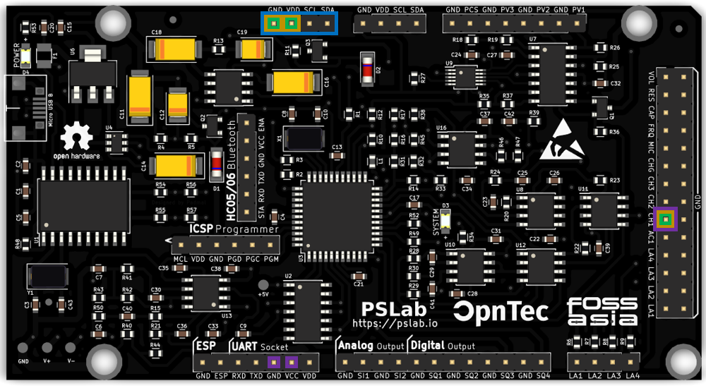

Currently the following sensors are supported by specific firmware, however [others](https://pslab.io/sensors/) could be added later on.

## CO_{2}e Sensor: [CCS811](https://cdn.sparkfun.com/assets/learn_tutorials/1/4/3/CCS811_Datasheet-DS000459.pdf)

This digital sensor is embedded on the [CJMCU-8118]() circuit board and powered by a custom [driver](https://github.com/fossasia/pslab-python/tree/development/pslab/external) that uses the sensors I^{2}C protocol.

The CCS811 measures the [CO_{2}e](https://klima.com/blog/what-is-co2e/) ("CO2 equivalent") value of the surrounding air, measured in particles per million (ppm). This value also incorporates the levels of methane (CH_{4}), nitrous dioxide (N_{2}O) and other synthetic gases, besides the regular CO_{2} measurement which usually makes up about 75% of the CO_{2}e. It is therefore used by environmental scientists nowadays to give more accurate measurements about the current levels of emissions in the air.

As emissions vary depending on the air's temperature and humidity, the CCS811 sensor has inbuilt temperature and moisture sensors. It uses those to offset the variation of the measuring conditions to the optimal lab conditions. However, it is important to notice that the sensor has a lower limit of 400ppm CO_{2}e that can be detected.

## Oxygen Sensor: [AO-03](http://www.aosong.com/userfiles/files/media/Datasheet%20AO-03.pdf)

The analoge AO-03 sensor measures the O_{2} content of the surrounding air in percent(%). It is embedded in a [custom circuit board](../docs/ao-03_amplifier_circuit_design/) that is amplifying the measured voltage, as the changes in oxygen levels are usually just very slight and therefore the changes in voltage are also only minimal.

Custom designed amplifying circuit board for the AO-03 oxygen sensor

## Light Intensity Sensor: [GL5528](https://pi.gate.ac.uk/pages/airpi-files/PD0001.pdf)

A light sensitive photo-resistor is used to measure the luminous intensity of the surrounding light waves in lumen per square meter (lux). The resistance of this sensor is measured within a voltage divider circuit with a second resistor of 10k Ohm. This value can then easily be transformed into the actual light intensity. Be aware that the luminous intensity is rising exponentially fast with increasing brightness levels of the environment.

## Temperature Sensor: [LM35](https://www.ti.com/lit/ds/symlink/lm35.pdf)

This analog thermometer can measure temperatures between −55°C and 150°C and keeps an ensured accuracy of +/- 1°C over this whole range.

## Connecting the Sensors

- **CO_{2}e** -> **blue** pins: 'VCC' to the PSLab's VDD (3.3V power supply), 'GND' to PSLab's GND, 'SLC' to the PSLab's SLC (serial clock needed for the I^{2}C protocol) and 'SDA' to the PSLab's SDA (serial data needed for the I^{2}C protocol)
- **Oxygen** -> **orange** pins: 'GND' to the PSLab's GND, 'OUT' to CH1 (analog input to read voltages in range [-16 V, +16 V]) and 'VCC' to the PSLab's VDD (3.3V power supply)
- **Light Intensity** -> **green** pins: '-' to the PSLab's GND, the middle pin to the PSLab's VDD (3.3V power supply) and 'S' to CH1 (analog input to read voltages in range [-16 V, +16 V])
- **Temperature** -> **purple** pins: left side to the PSLab's VCC (5V power supply), middle one to CH1 (analog input to read voltages in range [-16 V, +16 V]) and right side to the PSLab's GND [facing the flat side and having the sensor's pins face down]